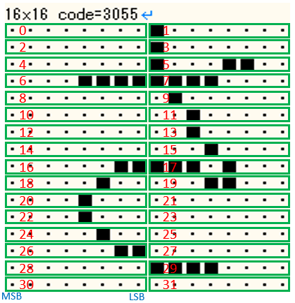
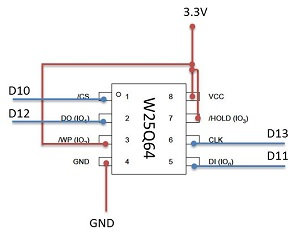
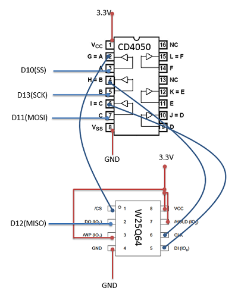
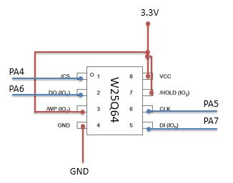
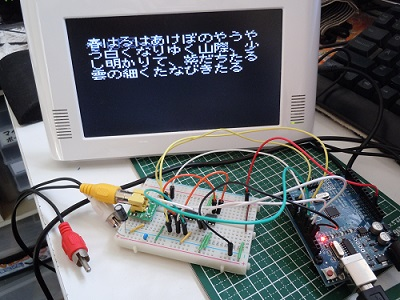
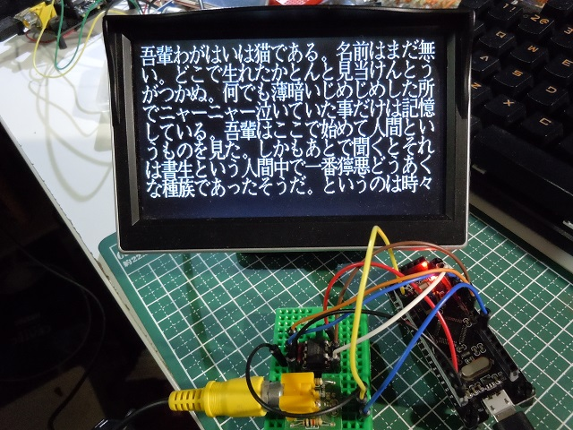
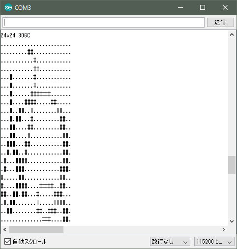

# Arduino_exfonts
Arduino用漢字フォントライブラリ SPI フラッシュメモリ版

## 概要
このライブラリはArduinoで利用出来る漢字フォントドライバーライブラリです。  
SPI接続のフラッシュメモリ W25Q64BVに格納したフォントデータを逐次参照し、  
 UTF-8コードに対応する漢字フォントデータの取得を可能にします。   
本ライブラリはArduinoおよびArduino STM32（Blue Pillボード）で利用出来ます。    

## ライブラリ名称
**exfonts** (ヘッダーファイル exfonts.h)

（注意）  
**Arduino用 SPI接続フラッシュメモリW25Q64ライブラリ**が必要です。  
https://github.com/Tamakichi/Arduino-W25Q64    

## 特徴

- フォントのサイズとして8,10,12,14,16,20,24の7種類をサポートします。
- UTF-8形式の文字の利用が可能です。
- フォントデータはSPI接続のフラッシュメモリ W25Q64BVに格納しています。
  同じインタフェースの25xxx系列で2Mバイト以上であれば利用出来ます。
- フォントデータの格納形式  
  - 横並び形式   
      
    ※ 赤い数値はバイトデータの並び順     
    ​

## 利用環境
- Arduino及びその互換機  、Arduino STM32がサポートするSTMF32F103C8T6ボード  
- 開発環境 Arduino IDE 1.8.x  
- SPI接続フラッシュメモリ W25Q64BV（同インタフェース25xxx系列2Mバイト以上でも可能）
  Arduinoでの利用（左：‘3.3V対応時、右：5V環境でのレベルシフト対応）  
      
  Arduino STM32 Blue Pillボードでの利用  
     

## 利用例  
Arduino Uno互換機でTVoutライブラリを使った日本語テキストの表示例  
     

Arduino STM32対応ボード（Black Pillボード）でTTVoutライブラリを使った日本語テキスト表示例  

   

  

## サポートするフォントの詳細

半角および、全角日本語ひらがな、カタカタ、漢字、英語アルファベット、ギリシャ文字,記号
半角カタカナはサポートしていません。半角カタカナのコードを指定した場合、全角カタカナに置き換えます。  

| フォントサイズ | 利用フォント      | フォント登録数 |
| ------: | ----------- | ------: |
|     8x4 | 美咲半角フォント    |     191 |
|     8x8 | 美咲フォント      |    6879 |
|    10x5 | ナガ10 半角     |     256 |
|   10x10 | ナガ10        |    6877 |
|    12x6 | 東雲半角フォント    |     256 |
|   12x12 | 東雲フォント      |    6879 |
|    14x7 | 東雲半角フォント    |     256 |
|   14x14 | 東雲フォント      |    6879 |
|    16x8 | 東雲半角フォント    |     256 |
|   16x16 | 東雲フォント      |    6879 |
|   20x10 | Kappa20 半角  |     190 |
|   20x20 | Kappa20     |    6879 |
|   24x12 | X11R6半角フォント |     221 |
|   24x24 | X11R6フォント   |    6877 |

## インストール
* /liblary/exfonts フォルダをArduinoのliblaryにコピーする。  
* /exfontbin フォルダ内の u_exfont.binをSPIフラッシュメモリに書き込む。  
  SPIフラッシュメモリに書き込みについては下記を参照して下さい。  
   - arduinoで利用可能な漢字フォントROMの製作（２）   
     http://nuneno.cocolog-nifty.com/blog/2015/02/arduinorom-a11f.html  

## ライブラリリファレンス
ライブラリはクラスライブラリとして実装しています。 
**exfonts**クラスのインスタンス（オブジェクト）を生成しメンバー関数を呼び出すことにより、  
機能利用することが出来ます。  

**ヘッダファイル**  
   `#include <exfonts.h>`

**定数一覧**  

    #define EXFONTNUM  14    // 登録フォント数
    #define FULL_OFST   7    // フォントサイズから全角フォント種類変換用オフセット値
    #define MAXFONTLEN  72   // 最大フォントバイトサイズ(=24x24フォント)
    #define MAXSIZETYPE 7    // フォントサイズの種類数
    // フォントサイズ
    #define  EXFONT8    0    // 8ドット美咲フォント
    #define  EXFONT10   1    // 10ドット nagaフォント
    #define  EXFONT12   2    // 12ドット東雲フォント
    #define  EXFONT14   3    // 14ドット東雲フォント
    #define  EXFONT16   4    // 16ドット東雲フォント
    #define  EXFONT20   5    // 20ドットkappa20フォント
    #define  EXFONT24   6    // 24ドットXフォント

**クラス名**  
`class espfonts;`

**メンバー関数一覧**  
- 初期化  
  `void init(uint8_t cs=10);`  
  フォント利用のための初期設定を行います。  
  引数csにはSPI接続フラッシュメモリのCSピンの番号を指定します。  

  ​

- フォントサイズの設定  
  `void setFontSize(uint8_t sz);`
  変数szには、利用するフォントサイズを番号で指定します。  
  指定する番号は0～6または、EXFONT8、EXFONT10、EXFONT12、EXFONT14、EXFONT16、EXFONT20、EXFONT24を指定します。  

  ​

- フォントサイズの取得  
  `uint8_t getFontSize();`

  現在利用しているフォントサイズを番号で取得します。    

  ​

- フォントデータの取得  
  `boolean getFontData(byte* fontdata,uint16_t utf16);`

  utf16に指定したUTF16フォントコードに該当するフォントデータを取得し、fontdataに格納します。  
  戻り値として、正常時はtrue、異常時はfalseを返します。   

  ​

- フォント横のバイト数取得  
  `uint8_t getRowLength()`  
  フォントの横一列を構成するために必要なバイト数を返します。    

  ​

- フォントの幅(ドット数)の取得  
  `uint8_t getWidth()`  
  フォントデータのフォント幅(ドット数)を返します。  

  ​

- フォントの高さ(ドット数)の取得  
  `uint8_t getHeight()`  
  フォントデータのフォント高さ(ドット数)を返します。  

  ​

**クラスメンバー関数一覧**  
- UTF8文字(1～3バイト)をUTF16に変換する   
  `static uint8_t espfonts::charUFT8toUTF16(uint16_t *pUTF16,char *pUTF8 )`    
  pUTF8で指定したUTF8文字をUTF16文字に変換しpUTF16に格納します。  
  戻り値として、変換処理したUTF8文字バイト数、0の場合は変換失敗を返します。    
  ​

- UTF8文字列をUTF16文字列に変換する  
  `static uint8_t espfonts::Utf8ToUtf16(uint16_t* pUTF16, char *pUTF8)`  
  pUTF8で指定したUTF8文字列をUTF16文字列に変換しpUTF16に格納します。  
  戻り値として、UFT16文字長さ (変換失敗時は-1を返す)を返します。    
  ​

## サンプルソースの解説
**exfonts_sample**、**exfonts_sample_stm32**はシリアルコンソールにフォントパターンを出力する簡単なプログラムです。  
指定した文字のパターンをキャラクタ文字にて表示しています。  
   

**tvout_font**、**ttvout_font_stm32**は、NTSCビデオ出力にて日本語テキストを表示するプログラムです。

## ライセンス・使用条件

フォントライブラリのプログラム部に関しては製作者本人に帰属しますが、自由に利用下さい。
フォントデータに関しては、著作権はフォントの各製作者に帰属します。

 ・ 8ドットフォント  
    美咲フォント [フリー（自由な）ソフトウエア]  
    http://www.geocities.jp/littlimi/misaki.htm  
    ライセンスに関する記載 http://www.geocities.jp/littlimi/font.htm#license  

 ・ 10ドットフォント  
    ナガ10(1.1):[独自ライセンス]  
    http://hp.vector.co.jp/authors/VA013391/fonts/#naga10  
    ライセンスに関する記載 \knj10-1.1\README  

 ・12/14/16ドットフォント  
    東雲フォント(0.9.6):[public domain]  
    http://openlab.ring.gr.jp/efont/shinonome/index.html.ja  
    ライセンスに関する記載 同HP  

 ・20ドットフォント  
    Kappa 20dot fonts(0.3):[public domain]  
   http://kappa.allnet.ne.jp/20dot.fonts/(リンク切れ)  

 ・24ドットフォント  
  X11R6同梱のフォント:[(通称)X11ライセンス]  
   http://www.x.org  

本ライブラリおよび配布するファイルは上記フォントの二次加工ファイルを含むのため、  
ライセンスについはては  使用フォントのライセンスに従うものとします。  

使用しているナガ10について商用利用に関する制約記載があるため  
本配布ファイルも個人および非営利目的での利用のみとします。   

またナガ10フォントの配布条件に従い、オリジナルのフォントとドキュメントを添付します。  

再配布については、本構成のままであれば自由とします。  
フォントファイルのみの配布は禁止します。  
